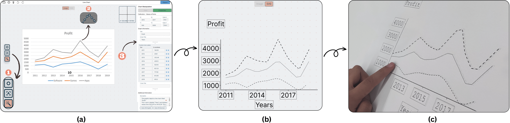

# Chart4Blind 

[**Project Page 🌐**](https://moured.github.io/chart4blind/) | [**Paper 📃**](www.google.com) | [**Contact 📨**](https://www.linkedin.com/in/omar-moured/)

## Description
We introduce the Chart4Blind system, designed to enable sighted users to seamlessly convert visualizations into print-accessible formats. Utilizing deep learning models in the backend, the system achieves high efficiency in processing. For more details, please refer to our published paper.

 
 
## Features (Jan 2024)

- Automatic and manual Input of Data Points on Chart
- SVG and CSV exports
- OCR tool for Labels, axes and descriptions
- snackbar for feedback

## Setup-Guide
Download and install **node** and **npm** through their website [NodeJS](https://nodejs.org/en/download/). Then, run the command
```bash
  npm install
```

## Citation

If you find this useful for your work, please cite us.

```bibtex
To be added
```
